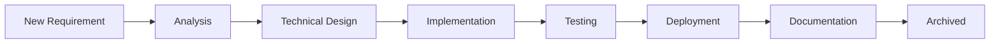

# Requirements Documentation

> Tài liệu tổng hợp yêu cầu và đặc tả kỹ thuật cho hệ thống

---

## 📋 Active Requirements

### 1. Organization Daily Statistics ✅

**Status:** Implemented (2026-02-02)  
**Priority:** High  
**Category:** Analytics & Reporting

#### Business Requirements

Leadership cần thống kê hằng ngày về:
- Tổng số task/project lũy kế
- Task mới phát sinh, hoàn thành, quá hạn
- Tỷ lệ hoàn thành, tỷ lệ trễ hạn
- Số người tham gia làm việc

#### Technical Requirements

- [x] Dual daily snapshots: 12:00 PM và 17:30 PM
- [x] Track 17 core metrics
- [x] Flexible JSON field cho custom metrics
- [x] Auto-scheduled jobs (weekdays only)
- [x] REST API cho frontend consumption
- [x] Data retention: 2 years active, archive after
- [x] Native SQL queries cho performance

#### Implementation Status

- **Changelog:** [2026-02-02_organization-daily-stats.md](../changelog/2026-02-02_organization-daily-stats.md)
- **Files Created:** 15
- **Database Tables:** `organization_daily_stats`
- **API Endpoints:** 5 endpoints under `/api/v1/organization-stats`

---

## 📝 Pending Requirements

### 2. Notification Service for Stats Alerts

**Status:** Planned  
**Priority:** Medium  
**Category:** Notifications

#### Business Requirements

Tự động gửi thông báo khi:
- Tỷ lệ quá hạn > 10%
- Tỷ lệ hoàn thành < 50%
- Số task quá hạn tăng đột biến

#### Technical Requirements

- [ ] Integration với existing notification service
- [ ] Configurable thresholds
- [ ] Multi-channel: Web, Email, Mobile
- [ ] Alert priority levels

---

### 3. Dashboard UI for Statistics Visualization

**Status:** Planned  
**Priority:** High  
**Category:** Frontend

#### Business Requirements

Leadership dashboard với:
- Charts/graphs cho metrics visualization
- Trend comparison
- Cross-organization comparison
- Export to Excel

#### Technical Requirements

- [ ] React/Vue component
- [ ] Chart library (Chart.js/D3.js)
- [ ] Real-time updates (WebSocket?)
- [ ] Responsive design

---

## 🔄 Requirements Workflow



### Requirement Lifecycle

1. **New:** Requirement identified
2. **Analysis:** Business & technical analysis
3. **Planned:** Added to backlog
4. **In Progress:** Development started
5. **Testing:** QA phase
6. **Deployed:** Live in production
7. **Archived:** Completed & documented

---

## 📊 Requirements by Category

### Analytics & Reporting (1)
- ✅ Organization Daily Statistics

### Notifications (1)
- ⏳ Stats Alert Notifications

### Frontend (1)
- ⏳ Dashboard UI

---

## 🔗 Related Documentation

- [Changelog Directory](../changelog/)
- [API Documentation](../docs/api/)
- [Database Schema](../docs/database/)

---

## 📝 How to Add New Requirements

1. **Create requirement document** trong `.docs/requirements/`
2. **Update this index** với requirement summary
3. **Link to implementation** khi completed
4. **Create changelog entry** sau khi deploy

### Requirement Template

```markdown
# [Requirement Name]

**Priority:** High/Medium/Low  
**Category:** [Category]  
**Stakeholder:** [Name]

## Business Requirements
What the business needs

## Technical Requirements
How to implement

## Acceptance Criteria
- [ ] Criterion 1
- [ ] Criterion 2

## Dependencies
- Dependency 1
- Dependency 2
```

---

*Last Updated: 2026-02-02*
